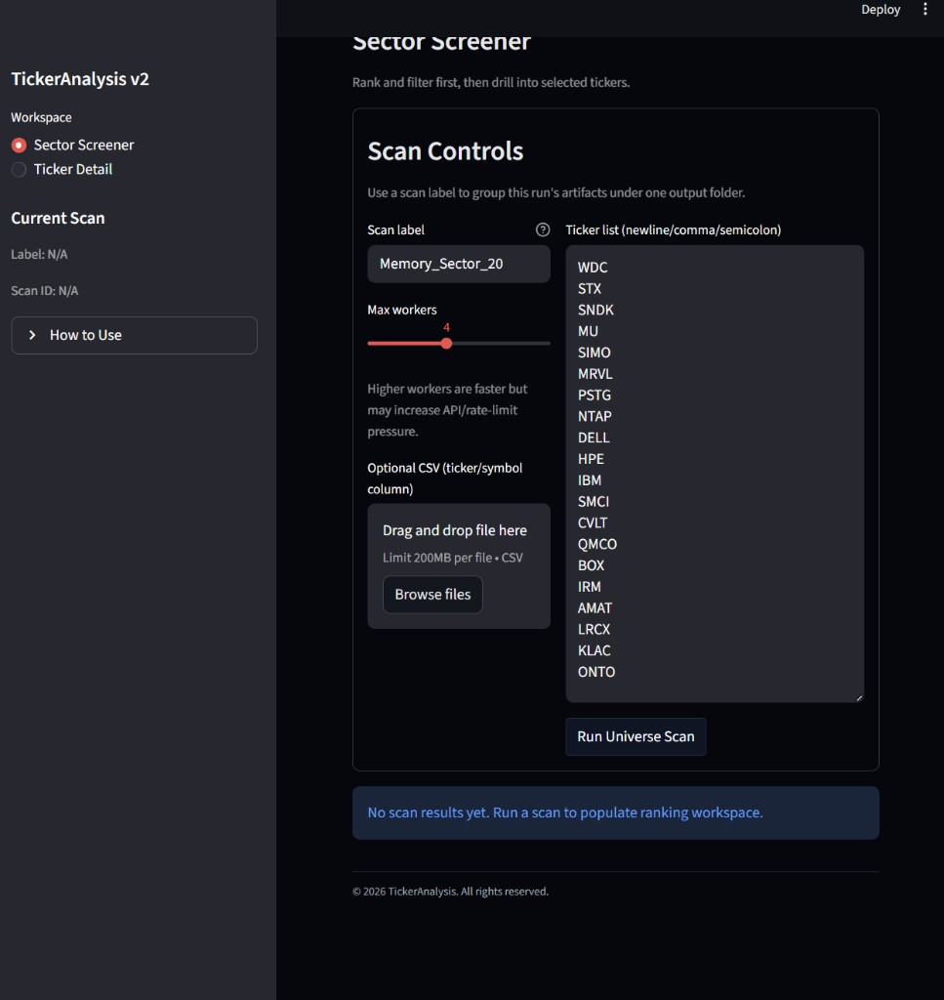
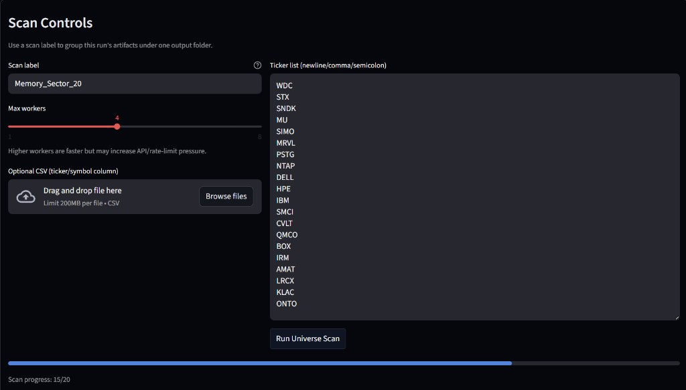
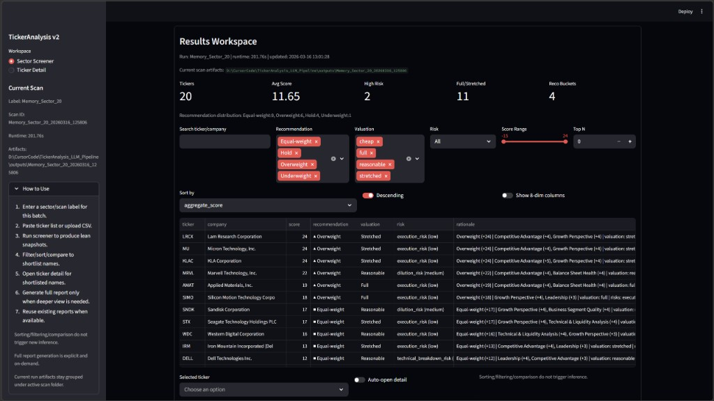
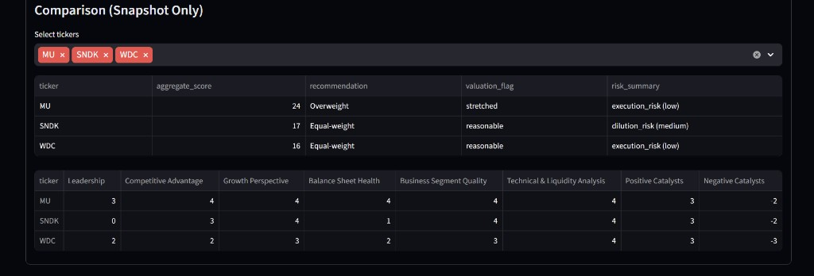
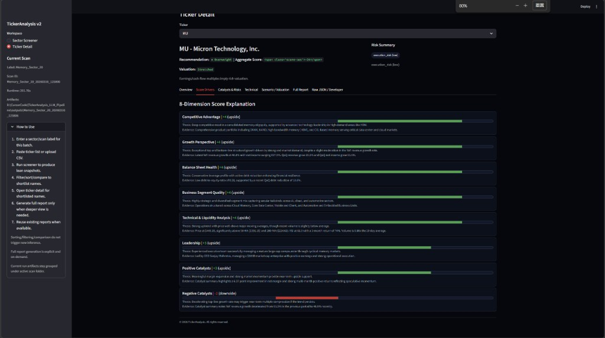
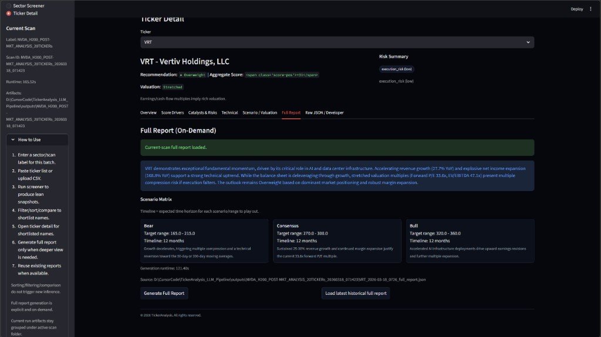
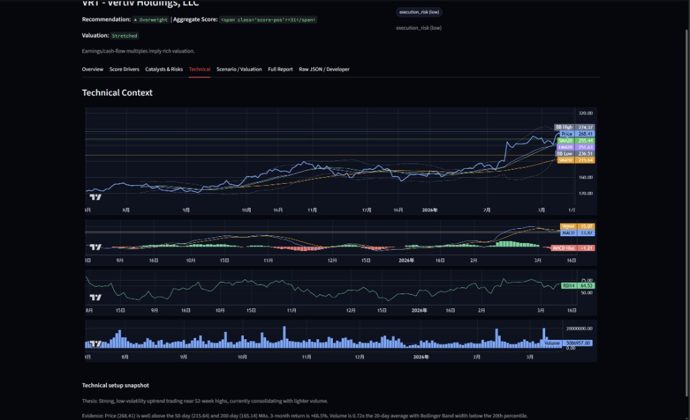

# TickerAnalysis LLM Pipeline (v2)

Terminal-style equity research workflow for:
- **fast universe screening** (default)
- **on-demand deep dives** (only for selected tickers)

---

## About

`TickerAnalysis LLM Pipeline` is a two-stage stock research product designed for practical buy-side style workflows:
1. scan many names quickly,
2. shortlist with structured evidence,
3. deep dive only when needed.

It is optimized for:
- low latency in multi-ticker runs
- controlled model cost
- structured outputs suitable for ranking/filtering
- reproducible UI interactions that do **not** trigger extra inference unless explicitly requested

> It works best for same-sector screens or portfolio analysis.

---

## High-Intensity Ongoing Updates

This project is in **active, high-frequency iteration**.  
Current focus:
- terminal UX polish
- stronger screener-first workflow
- better artifact grouping and report reuse
- quality/stability improvements for large batch scans

---

## Core Product Features

### 1) Two-stage research pipeline
- **Stage 1: Universe Scan / Ranking (default)**
  - input: multiline ticker list or CSV
  - output: lean snapshot report per ticker + ranking rows
  - one main LLM call per ticker
- **Stage 2: Full Report (explicit on-demand)**
  - only triggered by user action
  - adds `overall_outlook` and scenario `price_target_matrix`
  - one extra synthesis call only for selected names

### 2) Terminal-style Streamlit workspace
- **Sector Screener workspace** as default landing page
- **Ticker Detail workspace** for drill-down
- dark-first, dense, table-first layout
- deterministic filtering/sorting/comparison without extra model calls

### 3) Structured scorecard outputs
- exactly 8 scoring dimensions
- bounded integer scores
- recommendation + valuation/risk overlays
- strict validation for lean/full output modes

### 4) Scan-scoped report artifacts
- each scan run can write into its own output subfolder
- current scan artifacts are prioritized in detail loading
- historical reports can still be loaded explicitly

---

## Screenshots

### Screener controls + sidebar guidance


### Batch scan progress


### Results workspace (ranking/filtering)


### Multi-ticker comparison panel


### Detail page - score drivers


### Detail page - full report (conclusion first)


### Detail page - technical context


---

## Default Lean Output Schema

Top-level fields:
- `report_version`
- `report_metadata`
- `scorecard` (8 dimensions)
- `aggregate_score`
- `recommendation`
- `valuation_flag`
- `risk_flags`
- `validation`

Lean mode intentionally excludes verbose debug sections.

---

## Scorecard Dimensions

- `leadership`
- `competitive_advantage`
- `growth_perspective`
- `balance_sheet_health`
- `business_segment_quality`
- `technical_setup`
- `positive_catalysts`
- `negative_catalysts`

Each dimension includes:
- `score`
- `confidence` (`low|medium|high`)
- `thesis`
- `evidence`

Score ranges:
- first 6 dimensions: `-5..5`
- `positive_catalysts`: `0..5`
- `negative_catalysts`: `-5..0`

---

## Aggregation and Recommendation

- aggregate: `sum(8 dimension scores)` (equal-weight in v2.0; future-weight ready implementation)

Recommendation buckets:
- `>= 18`: `Overweight`
- `8..17`: `Equal-weight`
- `-7..7`: `Hold`
- `-17..-8`: `Underweight`
- `<= -18`: `Reduce`

---

## News & Catalyst Policy

- default: `ENABLE_NEWS=false`
- if enabled:
  - short lookback window
  - strict filtering and dedupe
  - small capped item count
- news is catalyst evidence only, not direct structural thesis input

---

## Quick Start

### 1) Setup

```bash
pip install -r requirements.txt
```

Copy env template:

```bash
cp .env.example .env
```

### 2) Single ticker

```bash
python llm_pipeline.py AAPL
```

Full mode:

```bash
python llm_pipeline.py AAPL --report-mode full
```

### 3) Universe scan

```bash
python universe_runner.py --tickers AAPL,MSFT,NVDA
```

or CSV:

```bash
python universe_runner.py --csv your_universe.csv --ticker-col ticker
```

### 4) Terminal UI

```bash
streamlit run streamlit_app.py
```

---

## Repository Structure

| Path | Purpose |
|------|--------|
| `llm_pipeline.py` | v2 orchestration entry (lean + optional full) |
| `universe_runner.py` | batch scan runner |
| `streamlit_app.py` | Streamlit launcher |
| `streamlit_terminal_ui.py` | terminal-style screener/detail UI |
| `report_schema.py` | schema constants + score helpers |
| `report_validation.py` | output validation |
| `prompt_templates.py` | prompt templates |
| `llm_clients.py` | model client wrappers |
| `catalyst_pipeline.py` | catalyst/event input layer |
| `fundamental_pipeline.py` | financial metrics pipeline |
| `technical_pipeline.py` | technical snapshot and features |
| `archetype.py` | archetype classification |
| `outputs/` | report artifacts |
| `docs/images/` | README screenshots |

---

## Notes

- Filtering, sorting, comparison, and tab switching are UI-side operations only.
- Full report generation remains explicit and on-demand.
- This repository will continue to receive frequent product and UX updates.
